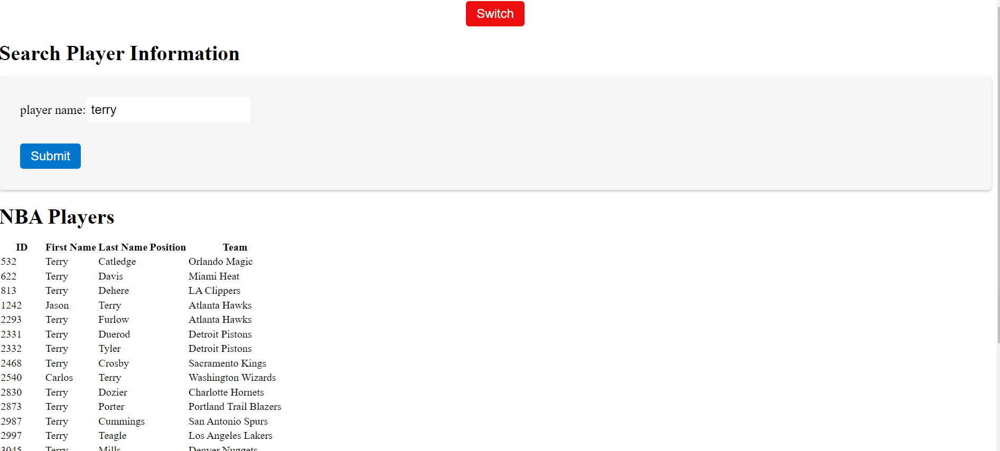
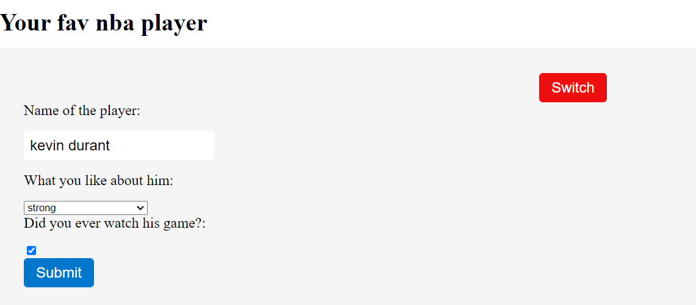
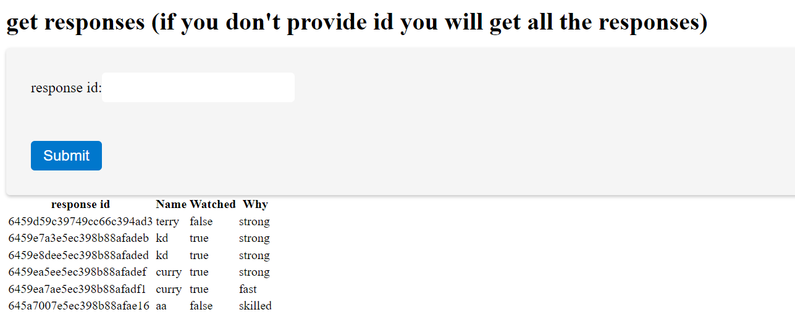

# Backend API
- Express, mongodb, node
#### Setup

```bash
npm install && npm start
```

#### Database Connection

1. Setup .env in the root
2. Add MONGO_URI with correct value

#### Player Model

1. name of the player (string, required)
2. why like the player (string, required, enum)
3. have user watched the player game before (boolean, required)

#### APIs

- POST /: Store form data into database. If successful, return the _id field generated by mongodb. 
- GET /: Return all user responses. 
- GET/{id}: Return a specific response. 

# Web application - https://github.com/Dengdengpi/nbaplayer-frontend
- for first page, user can type in the name and will display all nba players with that name
- the public api is GET https://www.balldontlie.io/api/v1/players with query parameter search


- if press the switch button on the top, then can take you to play with the apis of the app
- to submit form must provide values for all inputs otherwise give warning


- to get all the responses, you simply dont provide value for the input field
- if you want a specific response, provide the correct id


#### Improvements
- User interface could be prettier
- can add authentication and authorization
- can handle mongo errors better by using async error package and creating custom error classes
- deploy app
- can constantly refresh react app to display updated responses
- structure react app better
- same user cannot submit his favourite player twice 
